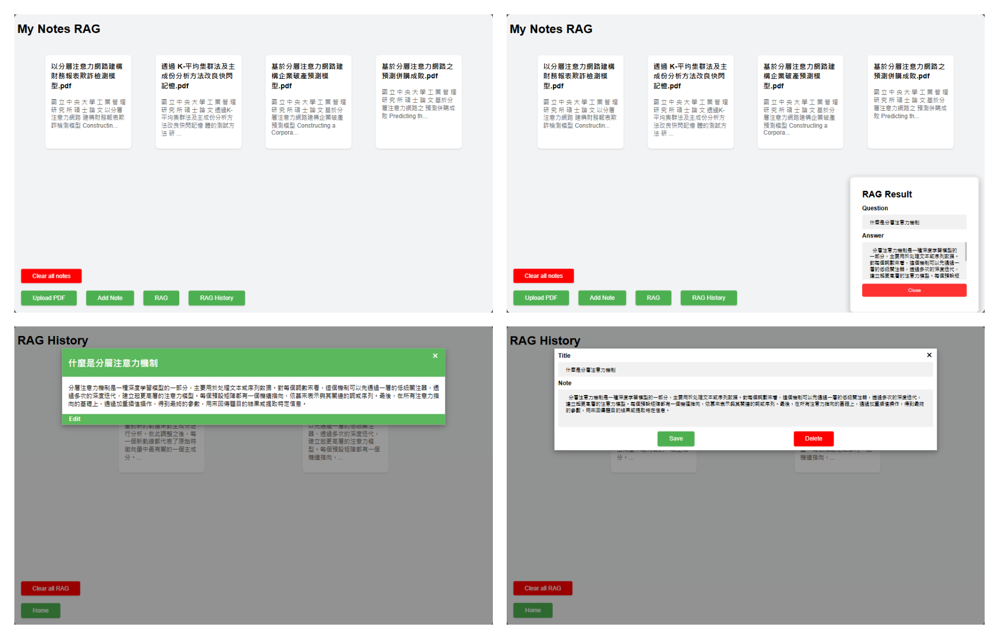

# 專案描述

這個專案展示了如何結合 Flask Web 框架、ChromaDB 數據庫和 ollama 模型，透過 RAG 來實現一個功能豐富的筆記管理應用。



## 所需導入的庫和模塊

- **Flask**：處理 Web 請求和響應。
- **ChromaDB**：數據存儲和檢索。
- **ollama**：文本嵌入和問答回答生成。
- **fitz (PyMuPDF)**：處理 PDF 文件。
- **waitress**：作為生產環境的 WSGI 服務器，預設在本地開發環境的 5500 端口上運行。

## 路由定義

- **index**：顯示主頁面，從 "embedding_db" 集合中獲取所有筆記並顯示。
- **select_note**：根據用戶請求中的 ID 選擇並返回一條筆記。
- **add_note**：允許用戶添加新筆記，並將筆記信息存儲到 "embedding_db" 集合中。
- **read_pdf**：處理上傳的 PDF 文件，提取文本並返回。
- **rag_note**：生成問答回答，並將問題和答案存儲到 "rag_history" 集合中。
- **edit_note**：允許用戶編輯現有筆記。
- **delete_note**：根據 ID 刪除指定筆記。
- **clear_database**：清空指定集合中的所有筆記。
- **rag_history**：從 "rag_history" 集合中獲取所有問答回答記錄並顯示。

# 基本教學

### 1. 下載程式檔案

使用 git：

```bash
git clone https://github.com/linyutsai1113/notes_rag.git
```

### 2. 建立 Python 環境

使用 conda：

```bash
conda create -n notes_rag python=3.9
conda activate notes_rag
pip install -r requirements.txt
```

### 3. 安裝 ollama

請到這裡下載 [Ollama](https://www.ollama.com/)，下載完成後，打開 terminal 並執行以下指令安裝對應模型：

```bash
ollama pull phi3:3.8b-mini-128k-instruct-q4_K_M
ollama pull mxbai-embed-large
```

### 4. 進入目標資料夾並執行程式

例如：

```bash
cd C:\Users\user\notes-RAG
python app.py
```
